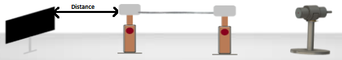

## Procedure 

1.  Connect the circuit by using the circuit diagram.
2.  Plug the AC mains. Light should appear at the end of the fiber on the NA fig. 1 The light intensity should increase.
3.  Hold the screen, provided in the Kit vertically at a distance of 15 mm (L) from the emitting fiber end and view the red spot on the screen. A dark room will facilitate good contrast. Position the screen-cum-scale to measure the diameter (W) of the spot. Choose the largest diameter.
4.  Compute NA from the formula  
    &emsp;NA = sinθmax\=W/(4L2+W2)½  
    Repeat the experiment for 10mm and 25mm distance of the screen.
5.  Calculate the acceptance angle θa = sin-1(NA).

**Figure 1: Set up for Measurement of NA**

