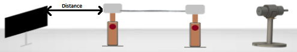

### Introduction

Numerical Aperture (NA) of any optical system is a measure of how much light can be collected by the optical system. It is the product of the refractive index of the incident medium and the sine of the maximum ray angle.

&emsp;NA = ni.sinθmax, ni for air is 1, hence NA = sinθmax

For a step-index fiber, as in the present case, the numerical aperture is given by  

&emsp;NA= (ncore2 –ncladding2)½

For very small difference in refractive indices the equation reduces to  

&emsp;NA=ncore (2Δ)½ where Δ is the fractional difference in refractive indices.  
  
The experimenter may refer to the specifications of the PMMA fiber given in Appendix I and record the manufacturer’s NA, ncladding and ncore, and θ

**Figure 1: Set up for Measurement of NA**

